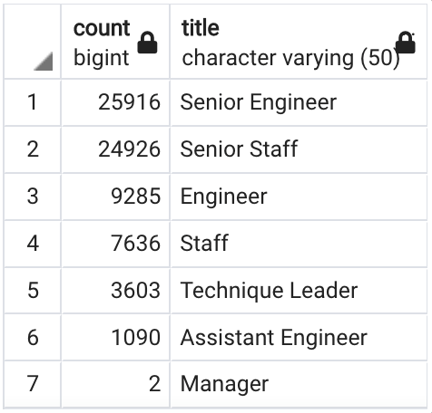

# SQL Analysis
---

## Overview of the Analysis
This SQL analysis is conducted to future-proof a hypothetical company, Pewlett Hackard, by preparing them for the Òsilver tsunami,Ó an anticipated wave of baby-boomer retirements. We will begin by examining this companyÕs staff and determining how many roles will need to be filled as older employees retire. Then, will find if there are enough qualified, retirement-ready employees in each department to mentor the next generation of Pewlett Hackard employees. The following will highlight four critical takeaways from our analysis and summarize our findings. 

## Results
Our **Unique Titles** table, see below, offers several important insights. 

**Unique Titles**

*This table holds all the titles of employees who were born between January 1, 1952 and December 31, 1955, and shows how many employees holding each title are current employed at Pewlett Hackard.

*By summing the "count" column in our **Unique Titles** table or counting the rows in unique_titles.csv, found in the data folder, we can see that there are 72,494 active employees imminently retiring. 

*Of these 72,494 employees, 50,842 (70%), hold a senior pay grade. 

*Assuming Engineer, Senior Engineer, Staff, and Senior Staff are the only pay grade for their respective positions, 64% of all Engineers and 69% of all Staff will be retiring! 

##Summary
As stated above, 72,494 roles will need to be filled as the Òsilver tsunamiÓ begins to make an impact. Our data in employees.csv includes only employees that were born in 1965 and earlier. So, it is not possible to know from this data how many employees will be needed to mentor the younger generation, as we do not know how many employees Pewlett Hackard has who were born after 1965. Our query in Deliverable 2 shows that there are 1,549 mentorship eligible employees born in 1965 who can assist, but this does not account for the 166,117 employees born after 1955 and before 1965 who could also assist with mentorship. This number was found by and additional query written at the bottom of Employee Database Challenge in the query folder. Another query found at the bottom can be used to determine the total number of Pewlett Hackard that are born after 1955 and not imminently retiring. With data in this format describing all Pewlett Hackard employees, not just those born in 1965 and earlier, we could give an more accurate assessment of mentorship and personnel needs. 
